<div align="center">

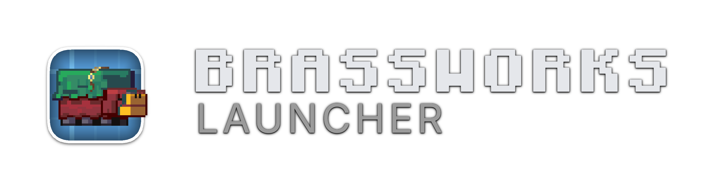

The official launcher for the Brassworks SMP. Built with Rust and Tauri under the hood, plus a React (Vite) frontend, it makes installing, managing, and launching our custom modpack as simple as possible.

### [**Download for macOS, Windows and Linux**](https://brassworks.opnsoc.org/launcher)

[](https://brassworks.opnsoc.org/launcher)
[](LICENSE)


[](https://crowdin.com/project/brassworks-launcher)

</div>

---

## Technical Architecture

To keep the launcher fast and reliable, it builds on existing open-source projects while making significant changes and improvements behind the scenes.

- Built on top of [portablemc](https://github.com/theorzr/portablemc) for resolving and launching Minecraft versions.
- Includes a from-scratch rewrite of the [packwiz](https://github.com/packwiz/packwiz) installer logic in Rust, with the [unsup](https://github.com/unascribed/unsup) update specification implemented on top for resumable, hash-verified pack updates.
- The core is a Cargo workspace of focused Rust crates (`brassworks-core`, `packwiz`, `portablemc`, `java`) behind a Tauri shell, so the heavy lifting stays native while the UI stays a thin React (Vite) layer.
- Java runtimes are provisioned automatically from Adoptium, and mod content resolves against both Modrinth and CurseForge.

---

## Features

<table>
<tr>
<td width="50%">
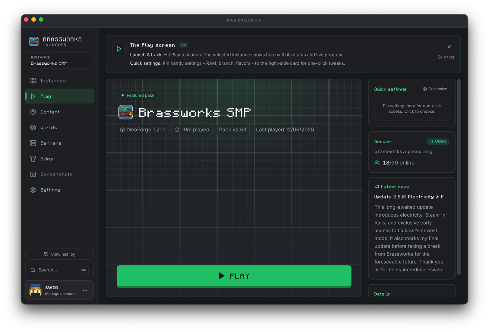
</td>
<td width="50%" valign="middle">
<h3>One click to play</h3>
The Play screen pulls together everything for the active instance - launch state, playtime, pack version, and the latest news from the server - so you are one button away from jumping in.
</td>
</tr>

<tr>
<td width="50%" valign="middle">
<h3>Instances and folders</h3>
Run as many instances as you like, side by side. Featured modpacks sit up top, while your own NeoForge, Forge, Fabric, and Vanilla setups stay tidy in collapsible folders.
</td>
<td width="50%">
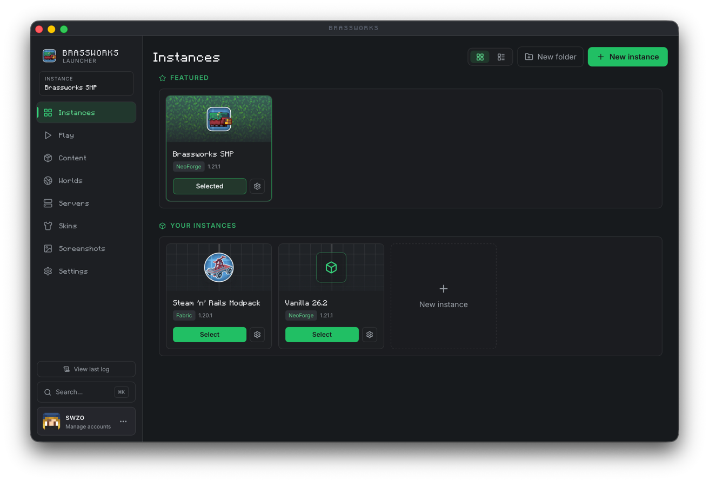
</td>
</tr>

<tr>
<td width="50%">
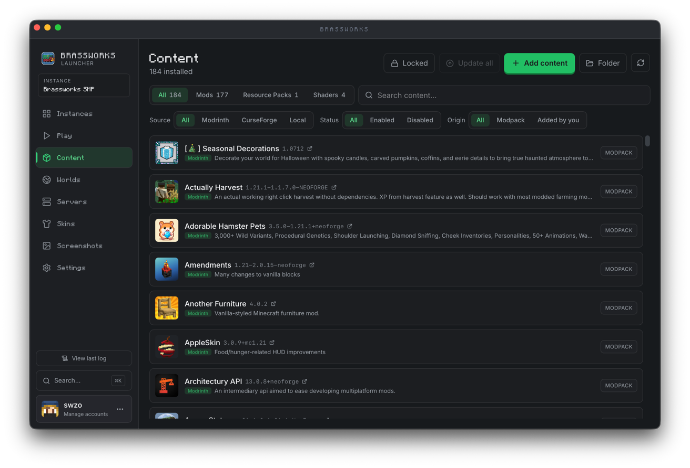
</td>
<td width="50%" valign="middle">
<h3>Browse and manage content</h3>
Search, install, and toggle mods, resource packs, shaders, and datapacks from one place. Filter by loader and source, and keep everything for an instance organised in a single view.
</td>
</tr>

<tr>
<td width="50%" valign="middle">
<h3>Skins and capes</h3>
Build skin presets as full loadouts - each with its own cape - then preview them on a live 3D model and apply with a single click.
</td>
<td width="50%">
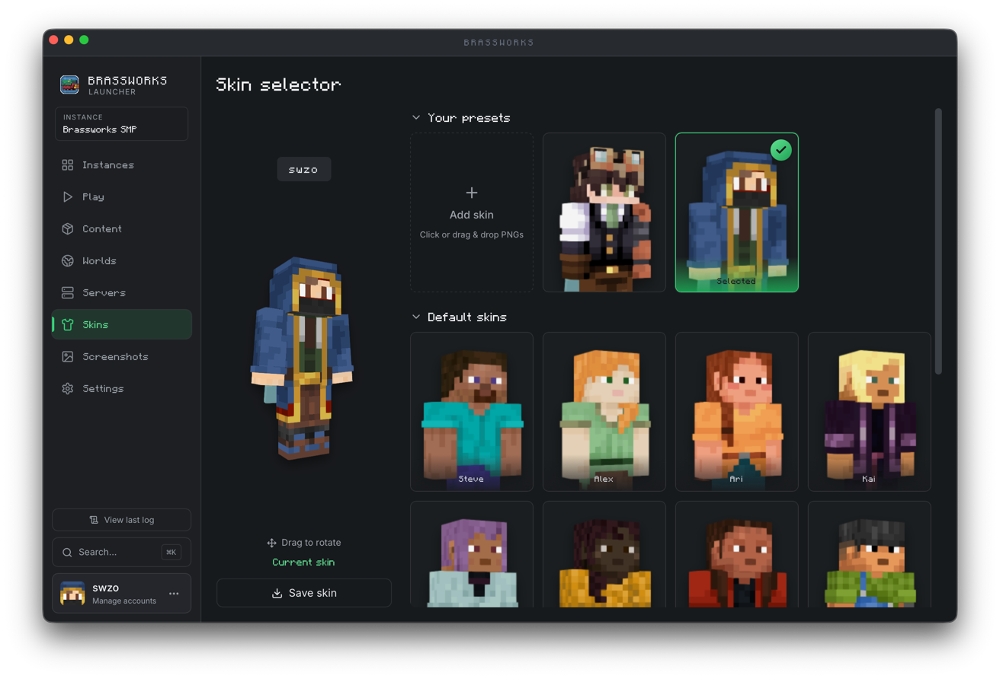
</td>
</tr>

<tr>
<td width="50%">
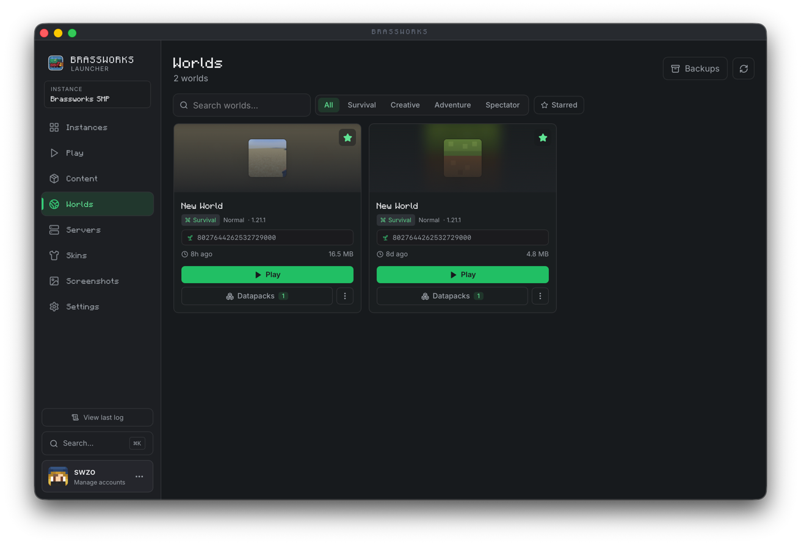
</td>
<td width="50%" valign="middle">
<h3>Worlds and backups</h3>
See every world for an instance at a glance, with gamemode, seed, size, and last-played details. Take backups, manage datapacks, and jump straight into a save.
</td>
</tr>

<tr>
<td width="50%" valign="middle">
<h3>Servers at a glance</h3>
Star your favourites and keep an eye on live player counts and ping. The Brassworks SMP is featured front and centre, with room for any other server you play on.
</td>
<td width="50%">
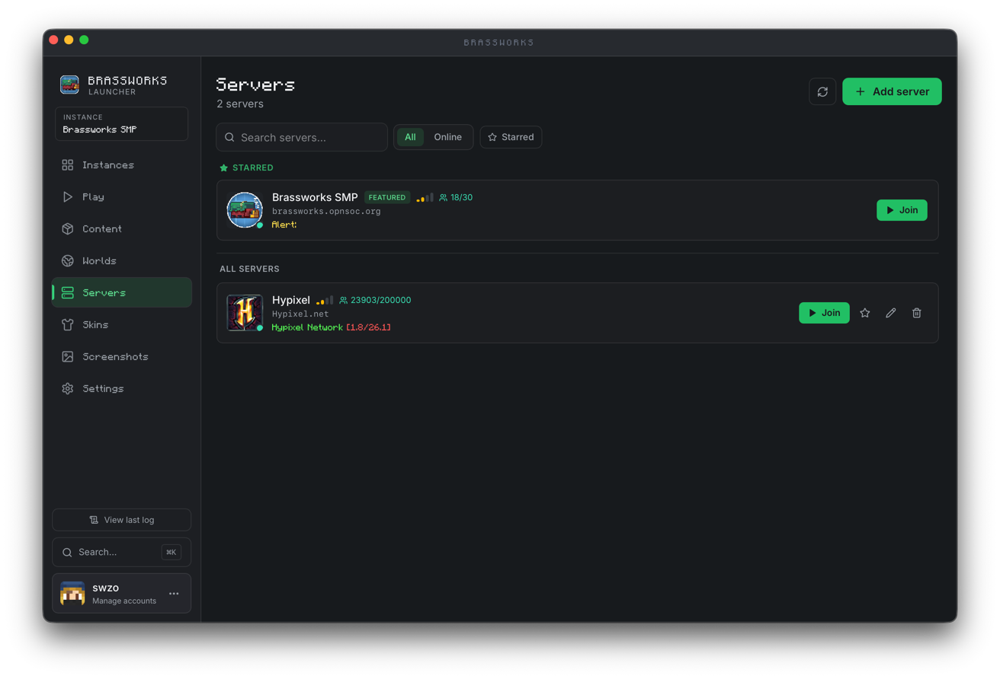
</td>
</tr>
</table>

---

## Command palette & CLI

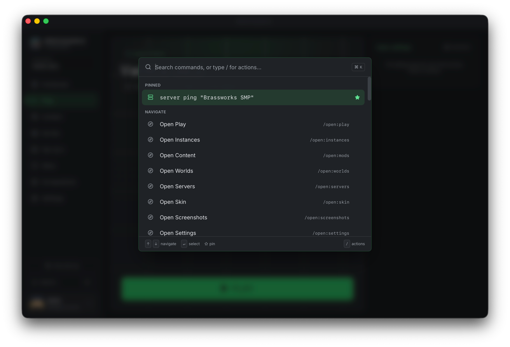

Press <kbd>⌘K</kbd> / <kbd>Ctrl K</kbd> to open the command palette. Start typing to
fuzzy-find any action, or type <kbd>/</kbd> to enter **command mode** - Discord-style
slash commands with per-argument autocomplete for everything the UI can do:

```
/instance launch survival --world "My Base"
/content install sodium --source modrinth
/modpack sync
/world backup survival
/skin apply knight
/settings set max-memory 8192
/theme brass-ocean
```

Press <kbd>Tab</kbd> to accept a suggestion, <kbd>Enter</kbd> to run. As you fill each
argument the palette shows its name and description, Discord-style. Type `/help` to
browse every command, pin the ones you use most, and chain several with `;` to
script them in sequence (`/go worlds ; /world backup survival`).

The same commands work from your terminal. Run **Settings → Launcher → Install
`brassworks` command** once, then:

```bash
brassworks help
brassworks instance launch survival
brassworks go settings
brassworks "content install sodium"
```

If the launcher is already running the command is forwarded to that window;
otherwise it starts the app and runs once the UI is ready. On macOS/Linux the
installer symlinks the executable onto your `PATH`; on Windows it writes a
`brassworks.cmd` shim you add to `PATH`. Settings → Launcher shows whether the
command is installed and lets you remove it again at any time.

---

## Share a pack

Small servers that want to share their packwiz modpack with players can hand them a single file - or link - that opens the launcher straight to an install. A `.packwiz` file is a small JSON pointer to your [packwiz](https://packwiz.infra.link/) pack: double-clicking it opens Brassworks to a confirmation screen with the pack's name, icon, description, and settings, then walks through the normal flavour and optional-content steps. The launcher registers itself as the handler for `.packwiz` files on macOS, Windows, and Linux, so they show up as branded documents.

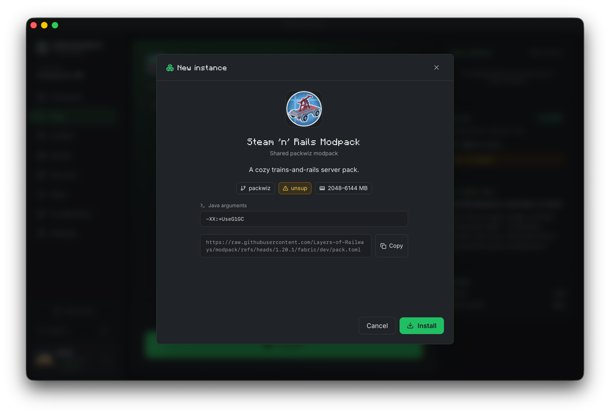

Only `pack_url` is required - everything else is optional and falls back to the pack's own defaults:

```json
{
  "pack_url": "https://packs.example.com/mypack/pack.toml",
  "name": "My SMP Pack",
  "description": "A cosy trains-and-rails server pack.",
  "unsup": true,
  "icon": "https://packs.example.com/mypack/icon.png",
  "banner": "https://packs.example.com/mypack/banner.png",
  "signing_key": "<ed25519 public key>",
  "news_url": "https://packs.example.com/mypack/news.json",
  "playercount_url": "https://packs.example.com/mypack/status.json",
  "min_memory_mb": 2048,
  "max_memory_mb": 6144,
  "jvm_args": ["-XX:+UseG1GC"]
}
```

The `news_url` and `playercount_url` fields point at small JSON endpoints the launcher polls and shows on the instance's Play screen. `news_url` returns a single news item:

```json
{
  "title": "Weekend event",
  "body": "Build contest starts Saturday at 3pm."
}
```

`playercount_url` returns live counts for your main server, plus an optional queue server. Every field defaults sensibly, so drop `queue` and `timestamp` if you don't need them:

```json
{
  "main": { "online": true, "players_online": 12, "players_max": 100 },
  "queue": { "online": false, "players_online": 0, "players_max": 0 },
  "timestamp": "2025-06-23T18:00:00Z"
}
```

A website can trigger the exact same install with a `brassworks://install?...` URL - no download needed. This script turns a pack file into one:

```python
import json, sys, urllib.parse

data = json.load(open(sys.argv[1]))
params = {}
for key, value in data.items():
    if value is None:
        continue
    if isinstance(value, bool):
        params[key] = "true" if value else "false"
    elif isinstance(value, list):
        params[key] = " ".join(map(str, value))
    else:
        params[key] = str(value)
print("brassworks://install?" + urllib.parse.urlencode(params))
```

Run it with the pack file as the argument:

```bash
python pack2url.py mypack.packwiz
```

---

## Make it yours

A handful of built-in themes and a customisable accent colour let you set the mood. Pick a look that matches how you play.

<table>
<tr>
<td width="25%" align="center">
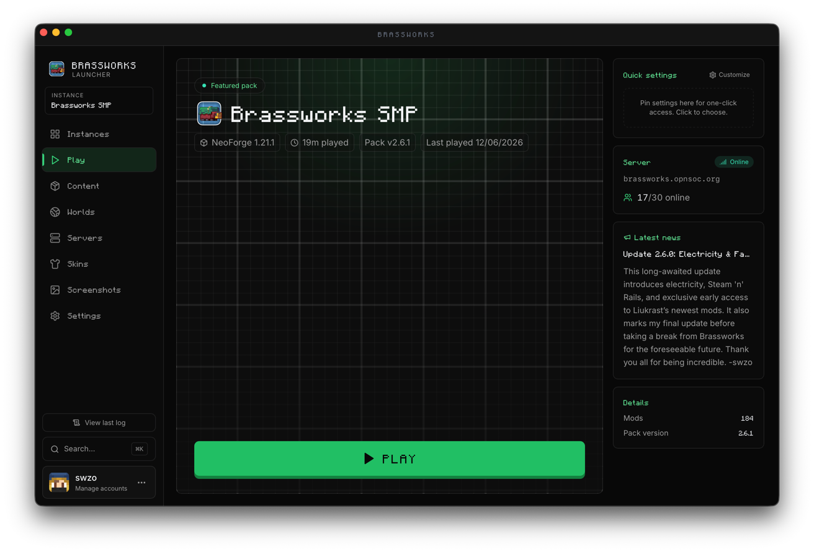
<br><sub><b>OLED</b></sub>
</td>
<td width="25%" align="center">
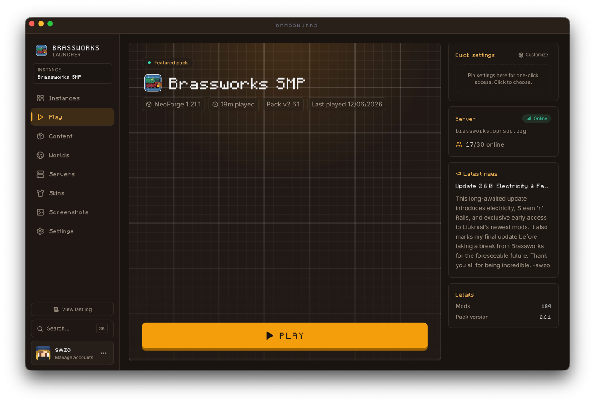
<br><sub><b>Mocha</b></sub>
</td>
<td width="25%" align="center">
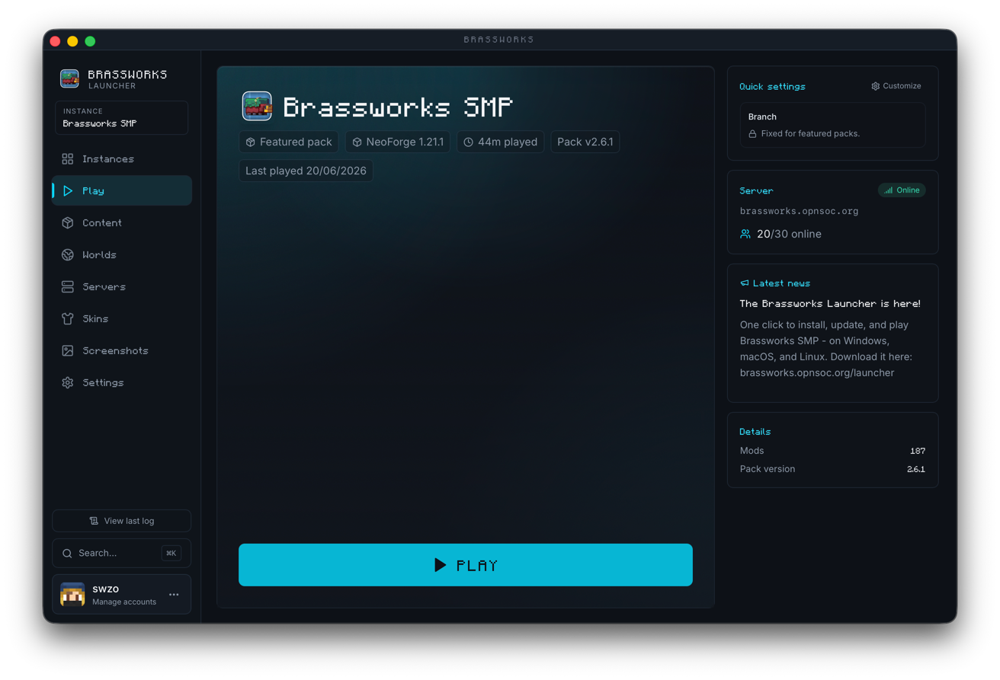
<br><sub><b>Ocean</b></sub>
</td>
<td width="25%" align="center">
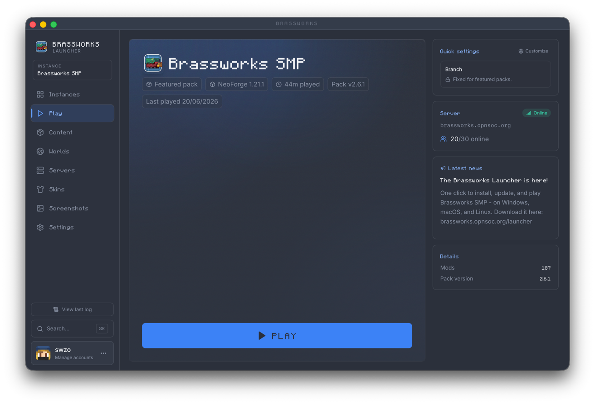
<br><sub><b>Nord</b></sub>
</td>
</tr>
<tr>
<td width="25%" align="center">
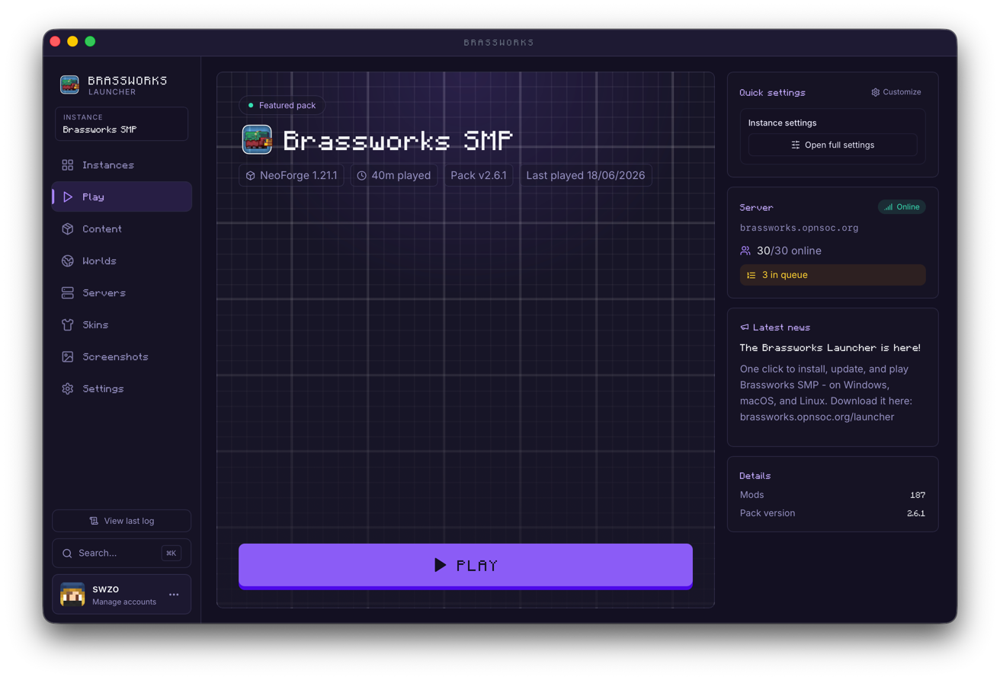
<br><sub><b>Amethyst</b></sub>
</td>
<td width="25%" align="center">
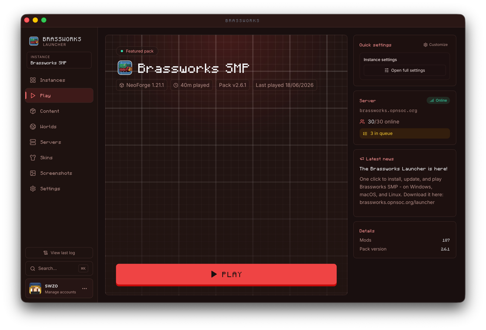
<br><sub><b>Crimson</b></sub>
</td>
<td width="25%" align="center">
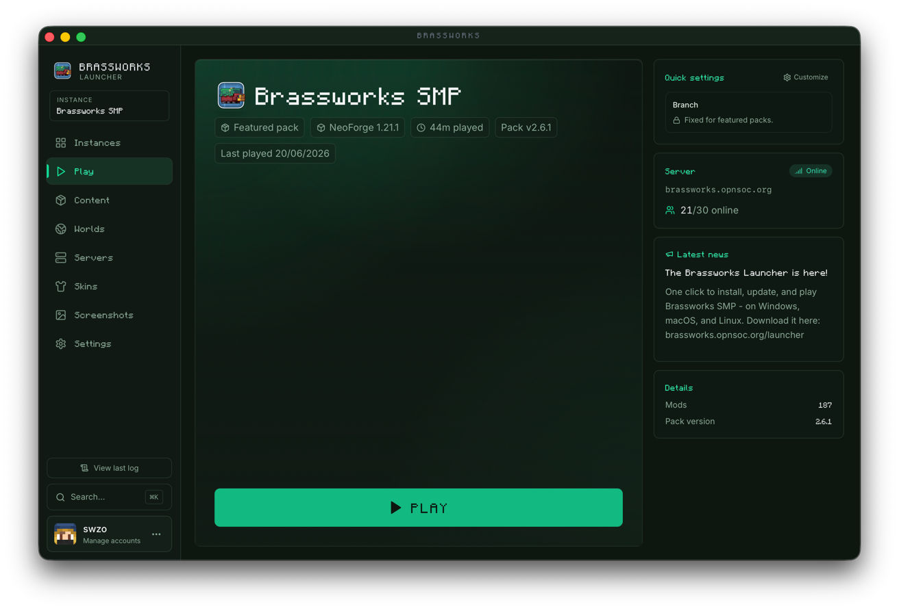
<br><sub><b>Forest</b></sub>
</td>
<td width="25%" align="center">
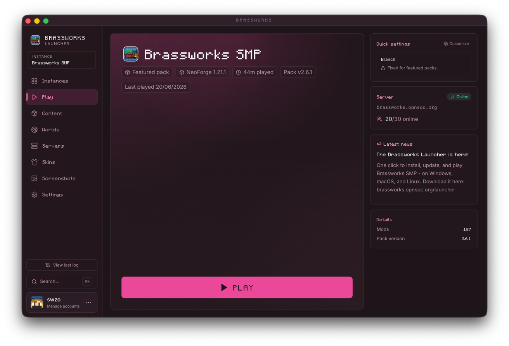
<br><sub><b>Rose</b></sub>
</td>
</tr>
</table>

<table>
<tr>
<td width="50%" align="center">
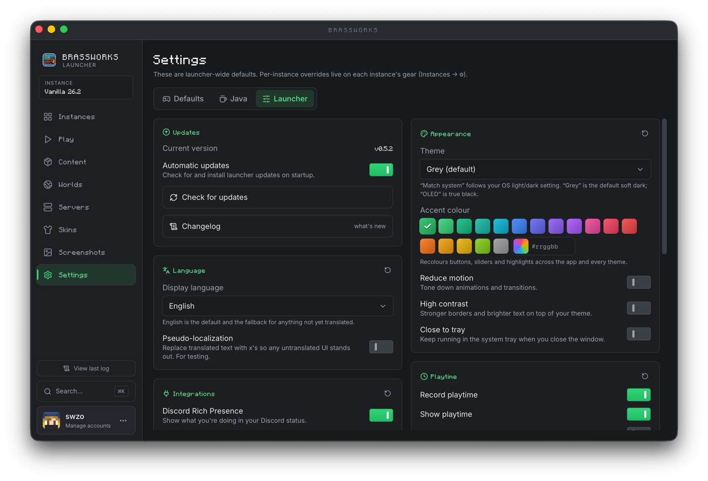
<br><sub><b>Customisable settings and accent colours</b></sub>
</td>
<td width="50%" align="center">
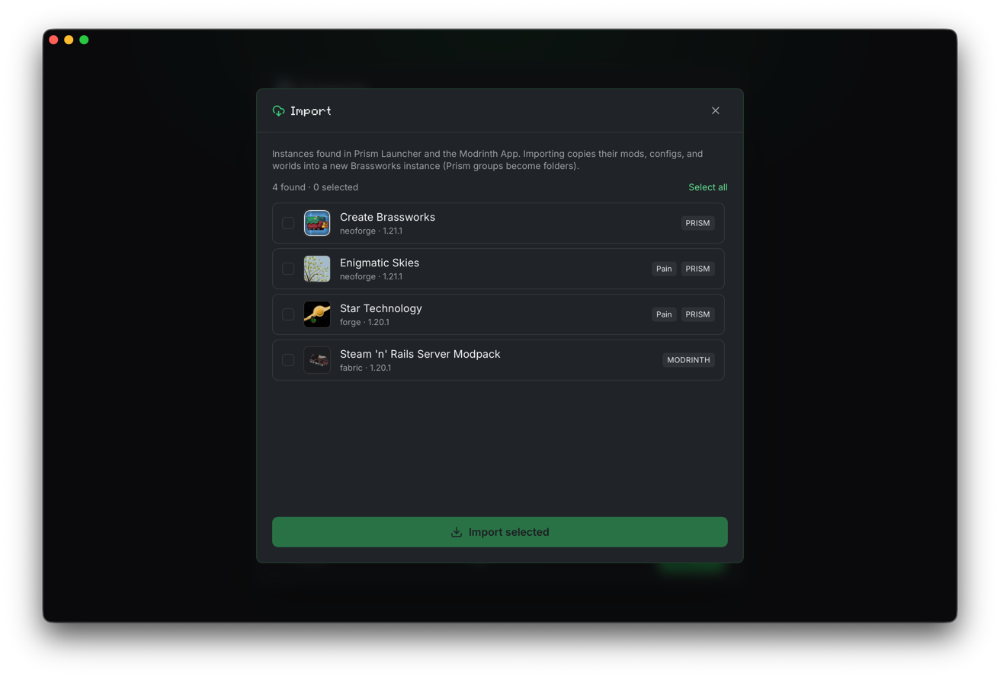
<br><sub><b>Import from Prism Launcher and Modrinth</b></sub>
</td>
</tr>
</table>

---

## Translations

[](https://crowdin.com/project/brassworks-launcher)

Brassworks Launcher is translated on **[Crowdin](https://crowdin.com/project/brassworks-launcher)**. Want the launcher in your language, or spot a wording that's off? Head to the Crowdin project, pick a language (or request a new one), and start translating - no coding required.

How it fits together:

- English is the source language and lives in [`frontend/lib/i18n/locales/en.json`](frontend/lib/i18n/locales/en.json) - the single source of truth, and the file Crowdin uploads as its source. Edit copy there.
- Finished translations come back as `frontend/lib/i18n/locales/<language>.json` and are loaded automatically. Anything not yet translated falls back to English.
- Only languages **more than 40% translated** are offered in the language picker, so users never land on a half-English UI. Per-language completeness is tracked in `frontend/lib/i18n/progress.json`.
- A GitHub Action keeps Crowdin in sync: it uploads new English strings, downloads translations, refreshes `progress.json`, and opens a pull request when anything changes.

---

## Development

The project is a Cargo workspace (Rust crates in `crates/` plus the Tauri shell in `frontend/src-tauri/`) with a React (Vite) frontend in `frontend/`.

### Prerequisites

- **Rust** 1.88 or newer
- **Node.js** 20 or newer
- **pnpm**

On Linux you also need the Tauri/WebKitGTK system libraries - `libwebkit2gtk-4.1-dev`, `libgtk-3-dev`, `libayatana-appindicator3-dev`, `librsvg2-dev`, and `patchelf`.

### To run the app

```bash
cd frontend
pnpm install
pnpm tauri dev
```

`pnpm tauri dev` starts the react and vite dev server and the Tauri window together; it rebuilds on changes to both the Rust and frontend code.

### Build installers

```bash
cd frontend
pnpm tauri build
```

The output is written to `target/release/bundle/`

### Quick checks

```bash
cargo check --workspace
```

---

## License

Brassworks Launcher is licensed under the **GNU General Public License v3.0 or later** (GPL-3.0-or-later). See [LICENSE](LICENSE) for the full text.
