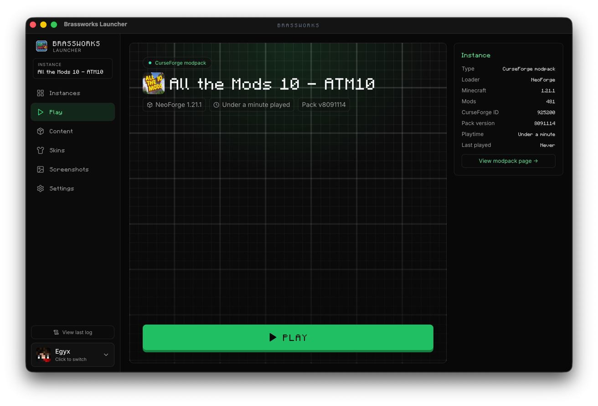
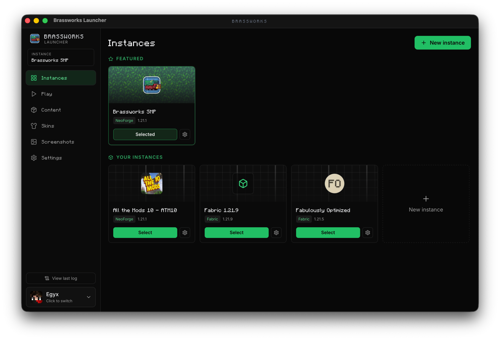
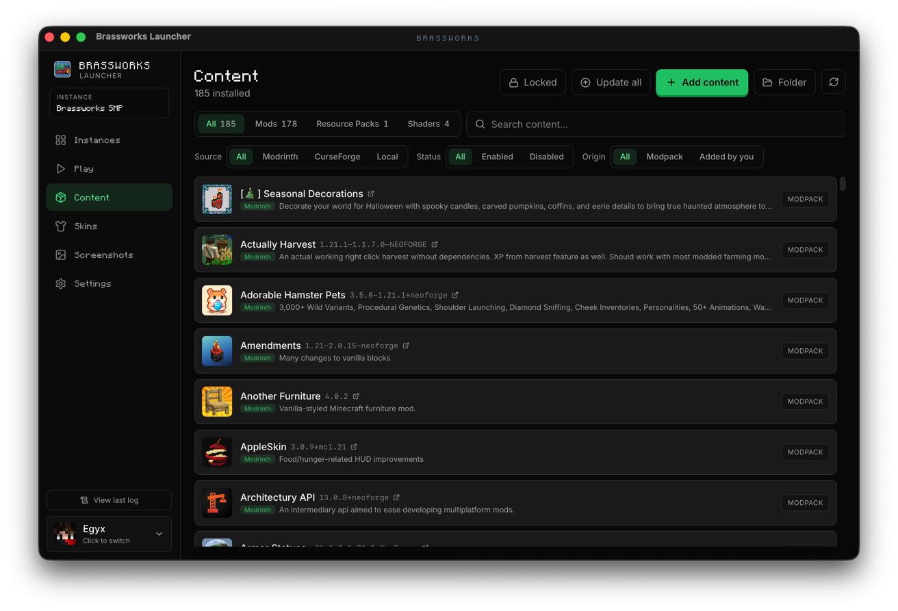
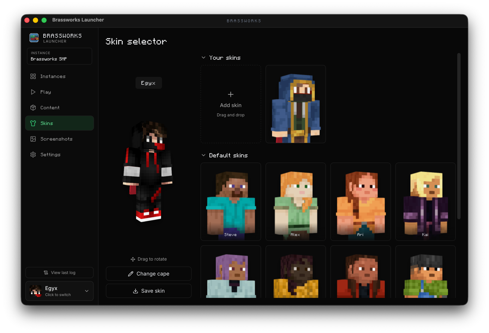
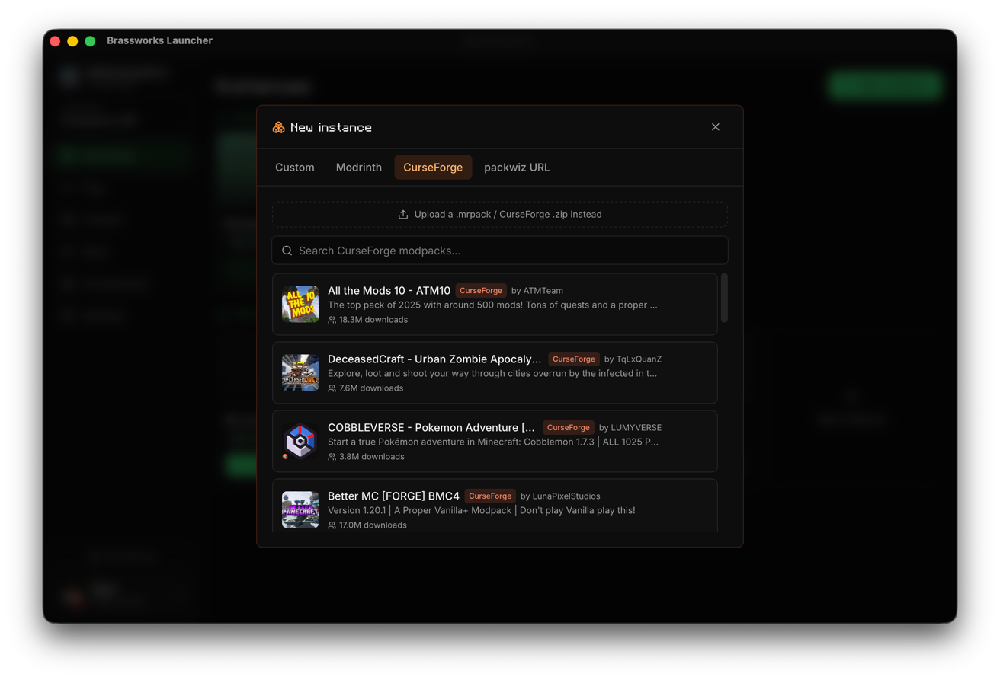
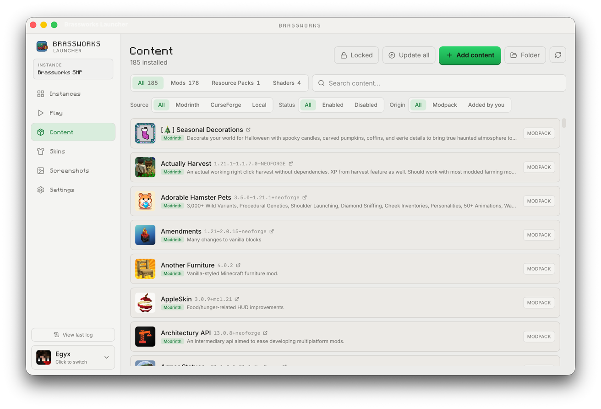

<div align="center">

# Brassworks Launcher

The official launcher for the Brassworks SMP. Built with Rust and Tauri under the hood, plus a React (Vite) frontend, it makes installing, managing, and launching our custom modpack as simple as possible.

---

## Technical Architecture

To keep the launcher fast and reliable, it builds on existing open-source projects while making significant changes and improvements behind the scenes.

- Built on top of [portablemc](https://github.com/theorzr/portablemc).
- Includes a rewrite of the [packwiz](https://github.com/packwiz/packwiz) installer logic implemented in Rust.

---

## Screenshots

<p align="center">
  
  <br><sub><b>Play menu</b></sub>
</p>

<p align="center">
  
  <br><sub><b>Instances</b></sub>
</p>

<p align="center">
  
  <br><sub><b>Content</b></sub>
</p>

<p align="center">
  
  <br><sub><b>Skins</b></sub>
</p>

<p align="center">
  
  <br><sub><b>CurseForge modpacks</b></sub>
</p>

<p align="center">
  
  <br><sub><b>Light mode</b></sub>
</p>

</div>

---

## Development

The project is a Cargo workspace (Rust crates in `crates/` plus the Tauri shell in `frontend/src-tauri/`) with a React (Vite) frontend in `frontend/`.

### Prerequisites

- **Rust** 1.88 or newer
- **Node.js** 20 or newer
- **pnpm**

On Linux you also need the Tauri/WebKitGTK system libraries - `libwebkit2gtk-4.1-dev`, `libgtk-3-dev`, `libayatana-appindicator3-dev`, `librsvg2-dev`, and `patchelf`.

### To run the app

```bash
cd frontend
pnpm install
pnpm tauri dev
```

`pnpm tauri dev` starts the react and vite dev server and the Tauri window together; it rebuilds on changes to both the Rust and frontend code.

### Build installers

```bash
cd frontend
pnpm tauri build
```

The output is written to `target/release/bundle/`

### Quick checks

```bash
cargo check --workspace
```
