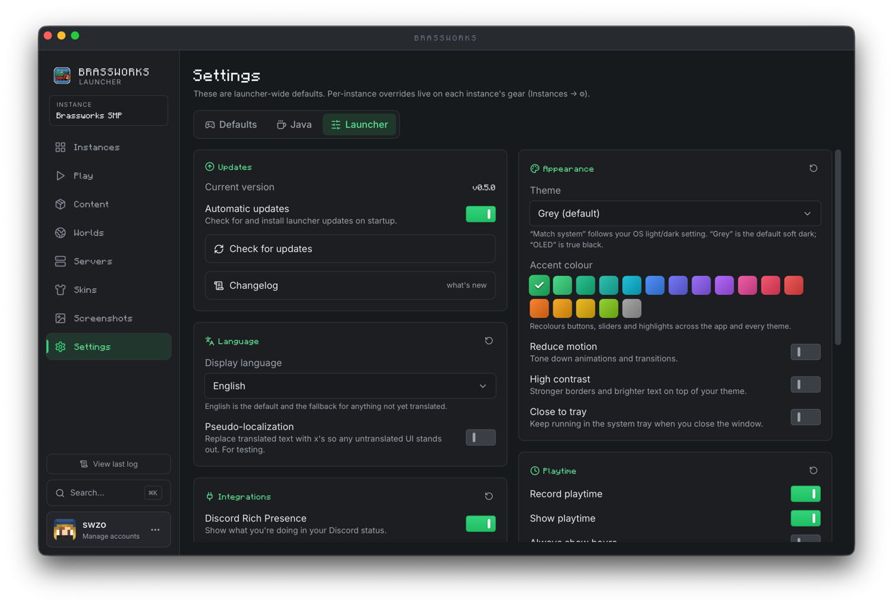

<div align="center">


The official launcher for the Brassworks SMP. Built with Rust and Tauri under the hood, plus a React (Vite) frontend, it makes installing, managing, and launching our custom modpack as simple as possible.

### [**Download for macOS, Windows and Linux**](https://brassworks.opnsoc.org/launcher)

[](https://brassworks.opnsoc.org/launcher)
[](LICENSE)


[](https://crowdin.com/project/brassworks-launcher)

</div>

---

## Technical Architecture

To keep the launcher fast and reliable, it builds on existing open-source projects while making significant changes and improvements behind the scenes.

- Built on top of [portablemc](https://github.com/theorzr/portablemc) for resolving and launching Minecraft versions.
- Includes a from-scratch rewrite of the [packwiz](https://github.com/packwiz/packwiz) installer logic in Rust, with the [unsup](https://github.com/unascribed/unsup) update specification implemented on top for resumable, hash-verified pack updates.
- The core is a Cargo workspace of focused Rust crates (`brassworks-core`, `packwiz`, `portablemc`, `java`) behind a Tauri shell, so the heavy lifting stays native while the UI stays a thin React (Vite) layer.
- Java runtimes are provisioned automatically from Adoptium, and mod content resolves against both Modrinth and CurseForge.

---

## Features

<table>
<tr>
<td width="50%">

</td>
<td width="50%" valign="middle">
<h3>One click to play</h3>
The Play screen pulls together everything for the active instance - launch state, playtime, pack version, and the latest news from the server - so you are one button away from jumping in.
</td>
</tr>

<tr>
<td width="50%" valign="middle">
<h3>Instances and folders</h3>
Run as many instances as you like, side by side. Featured modpacks sit up top, while your own NeoForge, Forge, Fabric, and Vanilla setups stay tidy in collapsible folders.
</td>
<td width="50%">

</td>
</tr>

<tr>
<td width="50%">

</td>
<td width="50%" valign="middle">
<h3>Browse and manage content</h3>
Search, install, and toggle mods, resource packs, shaders, and datapacks from one place. Filter by loader and source, and keep everything for an instance organised in a single view.
</td>
</tr>

<tr>
<td width="50%" valign="middle">
<h3>Skins and capes</h3>
Build skin presets as full loadouts - each with its own cape - then preview them on a live 3D model and apply with a single click.
</td>
<td width="50%">

</td>
</tr>

<tr>
<td width="50%">

</td>
<td width="50%" valign="middle">
<h3>Worlds and backups</h3>
See every world for an instance at a glance, with gamemode, seed, size, and last-played details. Take backups, manage datapacks, and jump straight into a save.
</td>
</tr>

<tr>
<td width="50%" valign="middle">
<h3>Servers at a glance</h3>
Star your favourites and keep an eye on live player counts and ping. The Brassworks SMP is featured front and centre, with room for any other server you play on.
</td>
<td width="50%">

</td>
</tr>
</table>

---

## Make it yours

A handful of built-in themes and a customisable accent colour let you set the mood. Pick a look that matches how you play.

<table>
<tr>
<td width="33%" align="center">

<br><sub><b>OLED</b></sub>
</td>
<td width="33%" align="center">

<br><sub><b>Mocha</b></sub>
</td>
<td width="33%" align="center">

<br><sub><b>Ocean</b></sub>
</td>
</tr>
</table>

<table>
<tr>
<td width="50%" align="center">

<br><sub><b>Customisable settings and accent colours</b></sub>
</td>
<td width="50%" align="center">

<br><sub><b>Import from Prism Launcher and Modrinth</b></sub>
</td>
</tr>
</table>

---

## Translations

[](https://crowdin.com/project/brassworks-launcher)

Brassworks Launcher is translated on **[Crowdin](https://crowdin.com/project/brassworks-launcher)**. Want the launcher in your language, or spot a wording that's off? Head to the Crowdin project, pick a language (or request a new one), and start translating - no coding required.

How it fits together:

- English is the source language and lives in [`frontend/lib/i18n/locales/en.json`](frontend/lib/i18n/locales/en.json) - the single source of truth, and the file Crowdin uploads as its source. Edit copy there.
- Finished translations come back as `frontend/lib/i18n/locales/<language>.json` and are loaded automatically - shipping a new language is just merging that file. Anything not yet translated falls back to English.
- A GitHub Action keeps Crowdin in sync: it uploads new English strings and opens a pull request when translations are updated.

---

## Development

The project is a Cargo workspace (Rust crates in `crates/` plus the Tauri shell in `frontend/src-tauri/`) with a React (Vite) frontend in `frontend/`.

### Prerequisites

- **Rust** 1.88 or newer
- **Node.js** 20 or newer
- **pnpm**

On Linux you also need the Tauri/WebKitGTK system libraries - `libwebkit2gtk-4.1-dev`, `libgtk-3-dev`, `libayatana-appindicator3-dev`, `librsvg2-dev`, and `patchelf`.

### To run the app

```bash
cd frontend
pnpm install
pnpm tauri dev
```

`pnpm tauri dev` starts the react and vite dev server and the Tauri window together; it rebuilds on changes to both the Rust and frontend code.

### Build installers

```bash
cd frontend
pnpm tauri build
```

The output is written to `target/release/bundle/`

### Quick checks

```bash
cargo check --workspace
```

---

## License

Brassworks Launcher is licensed under the **GNU General Public License v3.0 or later** (GPL-3.0-or-later). See [LICENSE](LICENSE) for the full text.
