<div align="center">

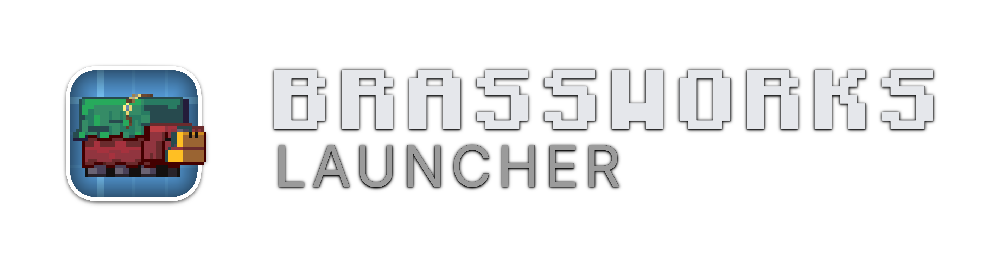

The official launcher for the Brassworks SMP. Built with Rust and Tauri under the hood, plus a React (Vite) frontend, it makes installing, managing, and launching our custom modpack as simple as possible.

### [**Download for macOS, Windows and Linux**](https://brassworks.opnsoc.org/launcher)

[](https://brassworks.opnsoc.org/launcher)
[](LICENSE)


[](https://crowdin.com/project/brassworks-launcher)

</div>

---

## Install on Linux

Every format ships as a file on the [latest release](https://github.com/Brassworks-smp/BrassworksLauncher/releases/latest), download the one for your distro and install it directly. The **AppImage** auto-updates in place; the package-manager formats below are updated by downloading the new file from a later release.

| Format | Install |
| --- | --- |
| **AppImage** (any distro, auto-updates) | `chmod +x Brassworks.Launcher_*_amd64.AppImage && ./Brassworks.Launcher_*_amd64.AppImage` |
| **Debian / Ubuntu** (`.deb`) | `sudo apt install ./Brassworks.Launcher_*_amd64.deb` |
| **Fedora / RHEL** (`.rpm`) | `sudo dnf install ./Brassworks.Launcher-*.x86_64.rpm` |
| **Arch** (`.pkg.tar.zst`) | `sudo pacman -U ./brassworks-launcher-bin-*-x86_64.pkg.tar.zst` |
| **Flatpak** (`.flatpak`) | `flatpak install ./brassworks-launcher_*_amd64.flatpak` |
| **Snap** (`.snap`) | `sudo snap install ./brassworks-launcher_*_amd64.snap --dangerous` |
| **Void** (`.xbps`) | put the file in a folder, then `xbps-rindex -a *.xbps && sudo xbps-install --repository=. brassworks-launcher` |

The `.deb`, `.rpm` and AppImage are produced by the release build; the Flatpak,
pacman, snap and xbps files are added by `.github/workflows/packages.yml`, which
repacks the release `.deb` and attaches them to the same release.

---

## Technical Architecture

To keep the launcher fast and reliable, it builds on existing open-source projects while making significant changes and improvements behind the scenes.

- Built on top of [portablemc](https://github.com/theorzr/portablemc) for resolving and launching Minecraft versions.
- Includes a from-scratch rewrite of the [packwiz](https://github.com/packwiz/packwiz) installer logic in Rust, with the [unsup](https://github.com/unascribed/unsup) update specification implemented on top for resumable, hash-verified pack updates.
- The core is a Cargo workspace of focused Rust crates (`brassworks-core`, `packwiz`, `portablemc`, `java`) behind a Tauri shell, so the heavy lifting stays native while the UI stays a thin React (Vite) layer.
- Java runtimes are provisioned automatically from Adoptium, and mod content resolves against both Modrinth and CurseForge.
- Schematic browsing uses the Brassworks cache proxy at `https://api.opnsoc.org/createmodschem` by default. Set `SCHEMATICS_CACHE_BASE` (or the legacy `CREATEMOD_CACHE_BASE`) to another mirror.

---

## Features

<table>
<tr>
<td width="50%">
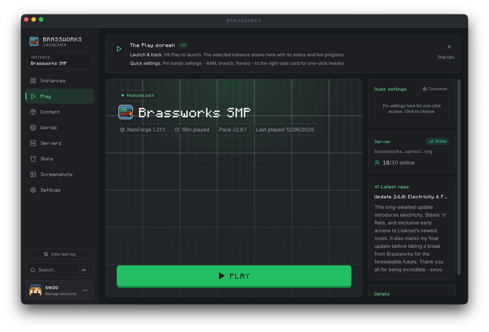
</td>
<td width="50%" valign="middle">
<h3>One click to play</h3>
The Play screen pulls together everything for the active instance - launch state, playtime, pack version, and the latest news from the server - so you are one button away from jumping in.
</td>
</tr>

<tr>
<td width="50%" valign="middle">
<h3>Instances and folders</h3>
Run as many instances as you like, side by side. Featured modpacks sit up top, while your own NeoForge, Forge, Fabric, and Vanilla setups stay tidy in collapsible folders.
</td>
<td width="50%">
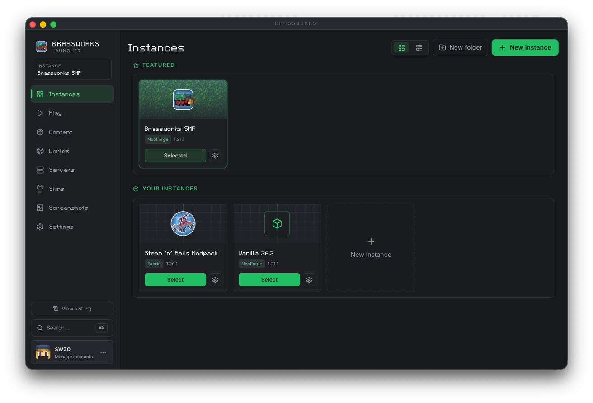
</td>
</tr>

<tr>
<td width="50%">
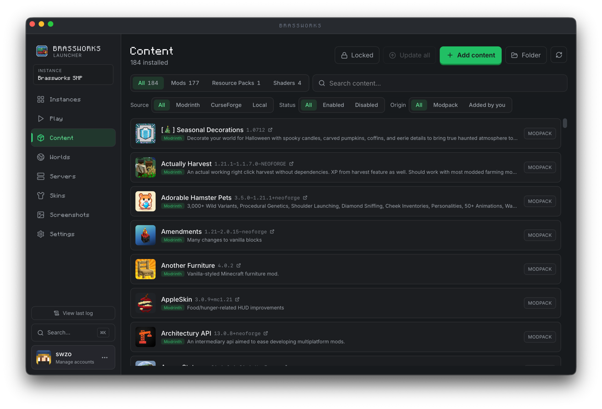
</td>
<td width="50%" valign="middle">
<h3>Browse and manage content</h3>
Search, install, and toggle mods, resource packs, shaders, and datapacks from one place. Filter by loader and source, and keep everything for an instance organised in a single view.
</td>
</tr>

<tr>
<td width="50%" valign="middle">
<h3>Skins and capes</h3>
Build skin presets as full loadouts - each with its own cape - then preview them on a live 3D model and apply with a single click.
</td>
<td width="50%">
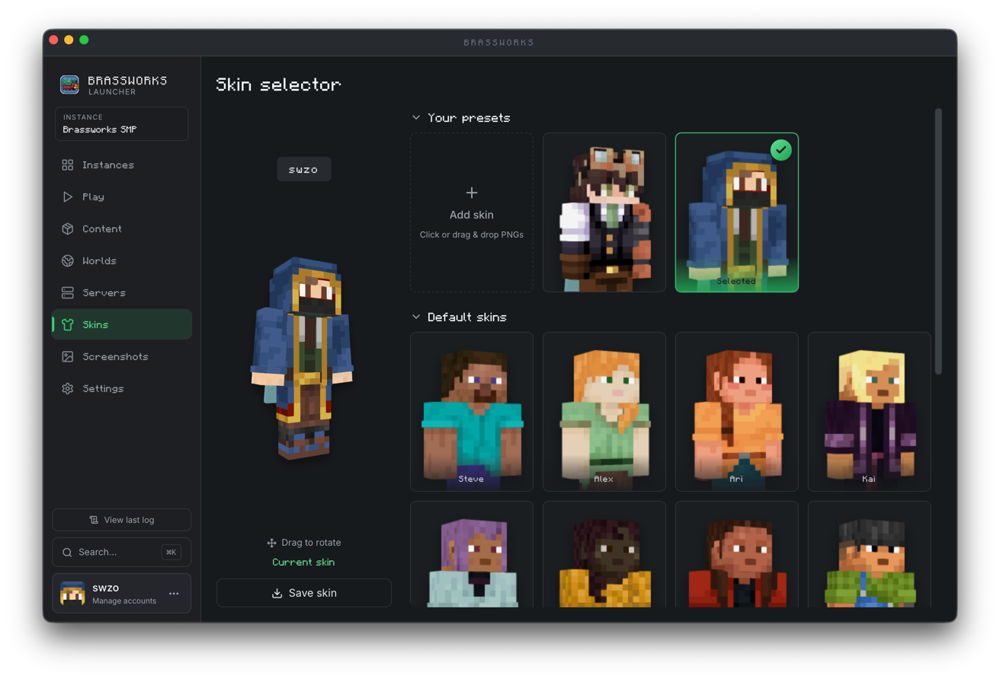
</td>
</tr>

<tr>
<td width="50%">
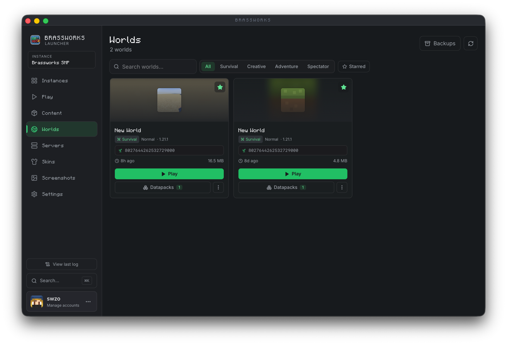
</td>
<td width="50%" valign="middle">
<h3>Worlds and backups</h3>
See every world for an instance at a glance, with gamemode, seed, size, and last-played details. Take backups, manage datapacks, and jump straight into a save.
</td>
</tr>

<tr>
<td width="50%" valign="middle">
<h3>Servers at a glance</h3>
Star your favourites and keep an eye on live player counts and ping. The Brassworks SMP is featured front and centre, with room for any other server you play on.
</td>
<td width="50%">
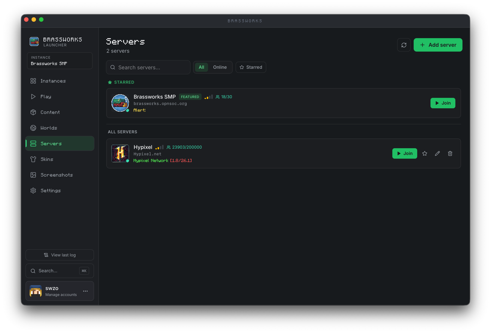
</td>
</tr>
</table>

---

## Schematic providers

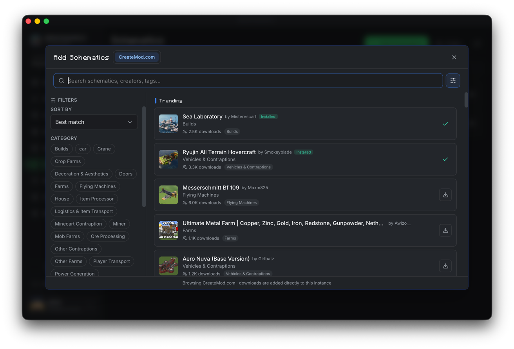

Each instance can expose a dedicated **Schematics** library. CreateMod.com is available for detected Create installations across Forge, NeoForge, Fabric, and Quilt, including the separate Create Fabric projects on Modrinth and CurseForge. Minecraft Schematics and Abfielder are available for detected Litematica, Forgematica, Schematica forks, or WorldEdit installations, including known Modrinth and CurseForge project IDs. The general providers can also be forced on or off from **Instance Settings → Integrations** when an unfamiliar fork is not detected.

The installed view follows the same local-first model as Content:

- `.nbt`, `.litematic`, `.schem`, `.schematic`, and `.mcstructure` files are listed, searchable, removable, and filterable by provider or **Local**.
- Schematics installed through Brassworks retain their provider title, author, artwork, description, project link, format, and provider identity. Files copied into a folder manually remain ordinary local schematics without invented provider metadata.
- Remote thumbnails, galleries, required-mod icons, and material previews use the launcher's on-disk image cache and continue to fall back safely to their original URLs.

Choose **Add Schematics** to browse every compatible provider. Paid or subscription-only Minecraft Schematics entries are excluded from browse, search, and direct-fallback results. Before downloading, Brassworks asks which available file format to install when the provider offers more than one compatible format. Minecraft-Schematics.com requires an account, so Brassworks explains the handoff, opens the schematic page in the user's browser, watches the configured Downloads folders, and imports the completed file automatically. A downloaded file can also be selected manually.

Opening a schematic shows its upload date, categories, every tag, dimensions, block count, Minecraft/Create versions, rating, downloads, and properly rendered HTML description. Gallery images open in the same full-window keyboard-navigable viewer as Screenshots. The detail view also includes:

- Required mods with cached artwork. Clicking one resolves the compatible Modrinth or CurseForge project and opens its normal Add Content page, including installed status, dependencies, version selection, and installation.
- A cached block-by-block materials list with counts and a one-click **Copy list** action.
- CreateMod.com version history with revision dates and change summaries.

Each file type can have its own per-instance folder. Relative paths are resolved inside the instance; absolute paths are supported. Defaults use `schematics`, except `.schem` and `.schematic` use `config/worldedit/schematics` when WorldEdit is installed without a Litematica-compatible mod. The launcher stores provider metadata separately, so replacing a downloaded schematic with a local file correctly removes the old association. Provider pages and images flow through the shared cache service; supported direct downloads are cached there too. Minecraft Schematics downloads stay in the user's authenticated browser session and are imported from Downloads instead.

If the shared cache reports a rate limit, Brassworks falls back to the provider from the desktop client. Fallback JSON and HTML are cached under the user's normal OS cache directory (five minutes for lists/searches, six hours for filters, and seven days for details), and an expired local entry is retained as a last-known-good response if the provider is temporarily unreachable. This keeps direct fallback traffic bounded rather than multiplying upstream requests across every search refresh.

---

## Command palette & CLI

<table>
<tr>
<td width="55%">
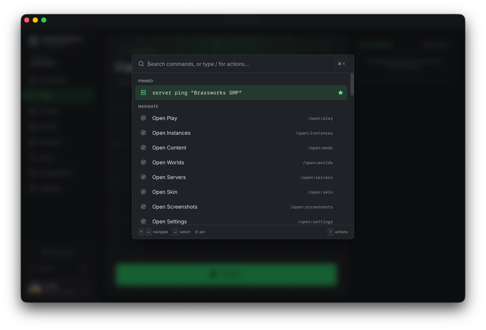
</td>
<td width="45%" valign="middle">

Press <kbd>⌘K</kbd> / <kbd>Ctrl K</kbd> to open the command palette. Start typing to
fuzzy-find any action, or type <kbd>/</kbd> to enter **command mode** - Discord-style
slash commands with per-argument autocomplete for everything the UI can do.

</td>
</tr>
</table>

Command mode covers the whole UI, with per-argument autocomplete as you type:

```
/instance launch survival --world "My Base"
/content install sodium --source modrinth
/modpack sync
/world backup survival
/skin apply knight
/settings set max-memory 8192
/theme brass-ocean
```

Press <kbd>Tab</kbd> to accept a suggestion, <kbd>Enter</kbd> to run. As you fill each
argument the palette shows its name and description, Discord-style. Type `/help` to
browse every command, pin the ones you use most, and chain several with `;` to
script them in sequence (`/go worlds ; /world backup survival`).

The same commands work from your terminal. Run **Settings → Launcher → Install
`brassworks` command** once, then:

```bash
brassworks help
brassworks instance launch survival
brassworks go settings
brassworks "content install sodium"
```

If the launcher is already running the command is forwarded to that window;
otherwise it starts the app and runs once the UI is ready. On macOS/Linux the
installer symlinks the executable onto your `PATH`; on Windows it writes a
`brassworks.cmd` shim you add to `PATH`. Settings → Launcher shows whether the
command is installed and lets you remove it again at any time.

---

## Export to any launcher

<table>
<tr>
<td width="45%" valign="middle">

Turn any instance into a shareable pack in **three formats** - packwiz, Modrinth `.mrpack`, or CurseForge `.zip` - straight from the launcher. A guided window lets you choose a format, pick exactly which mods, configs, and files to include, and name the pack with its author and version, then writes the finished pack to your Downloads folder.

Flip on **unsup flavors** to extend a packwiz pack with flavor groups, so players can choose variants (different mods or assets) when they install, and optionally **sign** the pack so installers can verify it's genuine. Save any setup as a reusable **export config** and re-export with a single click whenever the pack changes - blocked CurseForge mods are bundled in automatically so packs verify cleanly everywhere.

</td>
<td width="55%">
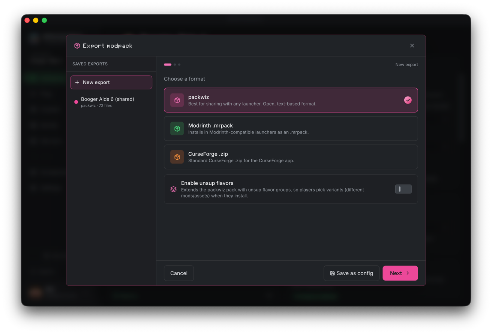
</td>
</tr>
</table>

---

## Publish and share your pack

<table>
<tr>
<td width="55%">
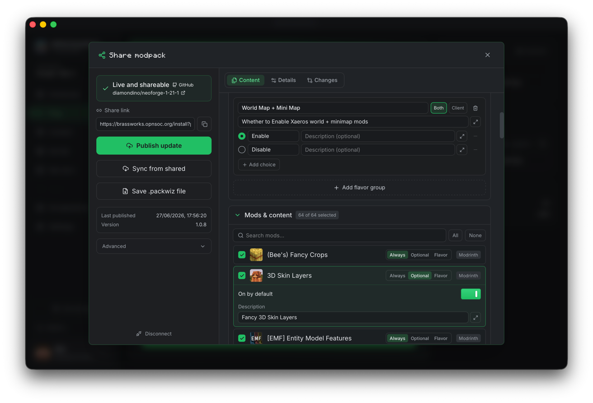
</td>
<td width="45%" valign="middle">

Turn any instance into a link you can hand to friends. Connect a GitHub or GitLab account once with an access token (stored only on your computer), and Brassworks publishes the pack to a repo for you and hands back a share link. When a friend opens it, the launcher installs an auto-updating copy that re-syncs every time you publish a change - or save the pack as a `.packwiz` file to share by hand.

A built-in **content editor** lets you pick exactly which mods, configs, and files go into the shared pack, author **flavor groups** so players can choose variants at install time, and mark mods as **optional**. The **Details** tab carries the pack description, RAM, JVM args, news and player-count sources; the **Changes** tab shows precisely what the next publish will push. **Publish update** pushes your edits, **Sync from shared** pulls the live pack back into your copy, and **Disconnect** unlinks at any time.

</td>
</tr>
</table>

> While you're hosting a pack, flavors and optional mods are locked on your **local** copy so the published version always contains every mod. You design the flavor and optional choices *for your players* in the Share window's content editor - linking an existing repo even re-enables anything local toggling had switched off, so nothing is missing from the published pack.

---

## The `.packwiz` share format

<table>
<tr>
<td width="45%" valign="middle">

Small servers that want to share their packwiz modpack with players can hand them a single file - or link - that opens the launcher straight to an install. A `.packwiz` file is a small JSON pointer to your [packwiz](https://packwiz.infra.link/) pack: double-clicking it opens Brassworks to a confirmation screen with the pack's name, icon, description, and settings, then walks through the normal flavour and optional-content steps. The launcher registers itself as the handler for `.packwiz` files on macOS, Windows, and Linux, so they show up as branded documents.

</td>
<td width="55%">
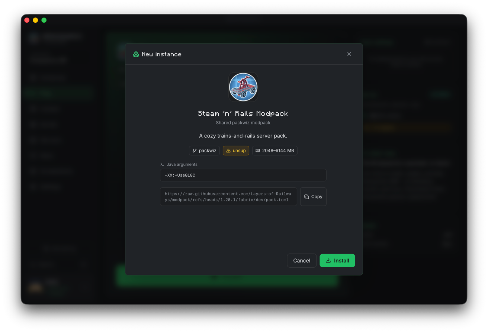
</td>
</tr>
</table>

Only `pack_url` is required - everything else is optional and falls back to the pack's own defaults:

```json
{
  "pack_url": "https://packs.example.com/mypack/pack.toml",
  "name": "My SMP Pack",
  "description": "A cosy trains-and-rails server pack.",
  "unsup": true,
  "icon": "https://packs.example.com/mypack/icon.png",
  "banner": "https://packs.example.com/mypack/banner.png",
  "signing_key": "<ed25519 public key>",
  "news_url": "https://packs.example.com/mypack/news.json",
  "playercount_url": "https://packs.example.com/mypack/status.json",
  "min_memory_mb": 2048,
  "max_memory_mb": 6144,
  "jvm_args": ["-XX:+UseG1GC"]
}
```

The `news_url` and `playercount_url` fields point at small JSON endpoints the launcher polls and shows on the instance's Play screen. `news_url` returns a single news item:

```json
{
  "title": "Weekend event",
  "body": "Build contest starts Saturday at 3pm."
}
```

`playercount_url` returns live counts for your main server, plus an optional queue server. Every field defaults sensibly, so drop `queue` and `timestamp` if you don't need them:

```json
{
  "main": { "online": true, "players_online": 12, "players_max": 100 },
  "queue": { "online": false, "players_online": 0, "players_max": 0 },
  "timestamp": "2025-06-23T18:00:00Z"
}
```

A website can trigger the exact same install with a `brassworks://install?...` URL - no download needed. This script turns a pack file into one:

```python
import json, sys, urllib.parse

data = json.load(open(sys.argv[1]))
params = {}
for key, value in data.items():
    if value is None:
        continue
    if isinstance(value, bool):
        params[key] = "true" if value else "false"
    elif isinstance(value, list):
        params[key] = " ".join(map(str, value))
    else:
        params[key] = str(value)
print("brassworks://install?" + urllib.parse.urlencode(params))
```

Run it with the pack file as the argument:

```bash
python pack2url.py mypack.packwiz
```

---

## Make it yours

A handful of built-in themes and a customisable accent colour let you set the mood. Pick a look that matches how you play.

<table>
<tr>
<td width="25%" align="center">
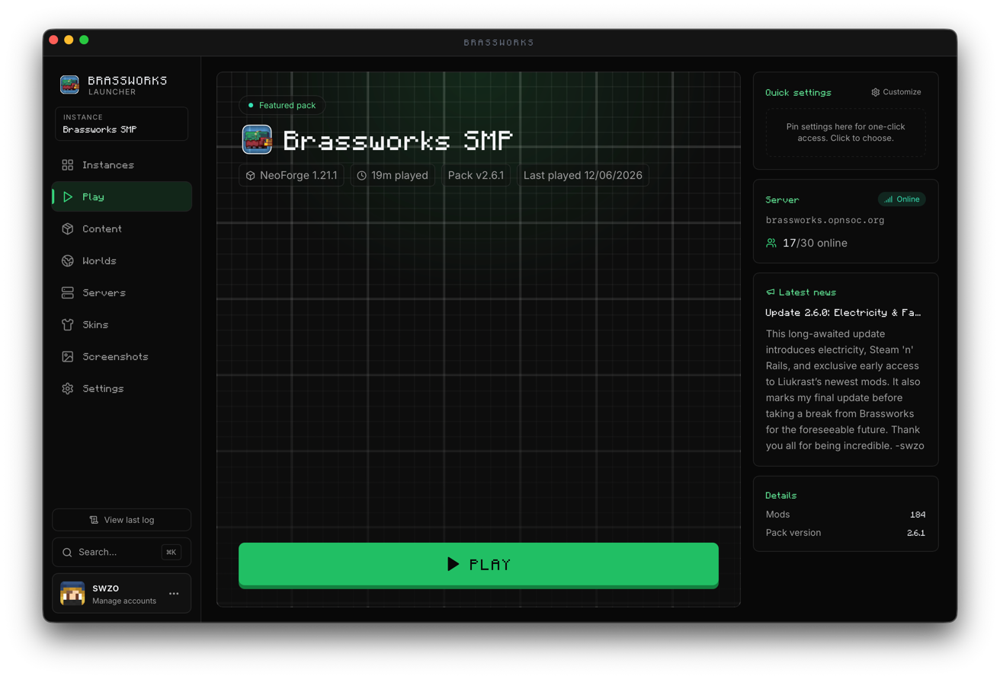
<br><sub><b>OLED</b></sub>
</td>
<td width="25%" align="center">
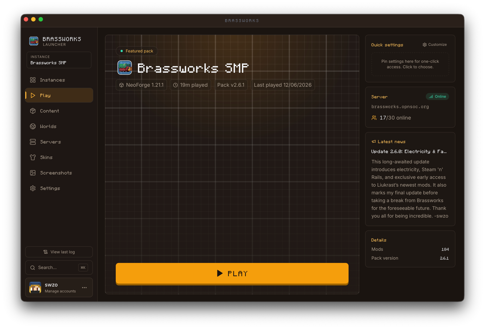
<br><sub><b>Mocha</b></sub>
</td>
<td width="25%" align="center">
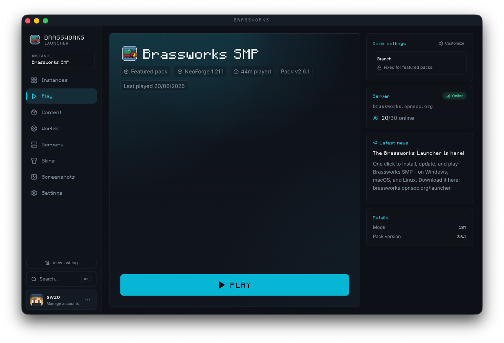
<br><sub><b>Ocean</b></sub>
</td>
<td width="25%" align="center">
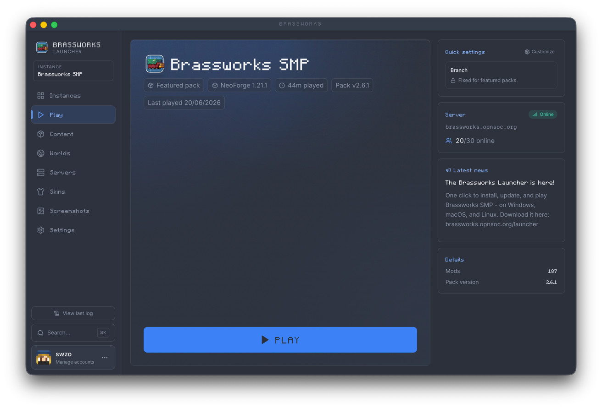
<br><sub><b>Nord</b></sub>
</td>
</tr>
<tr>
<td width="25%" align="center">
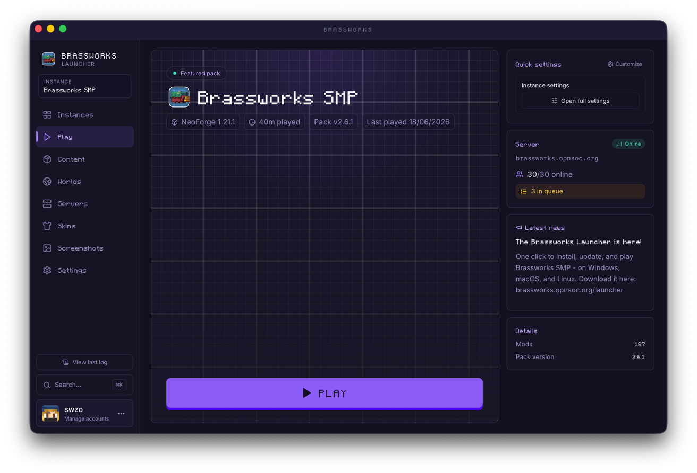
<br><sub><b>Amethyst</b></sub>
</td>
<td width="25%" align="center">
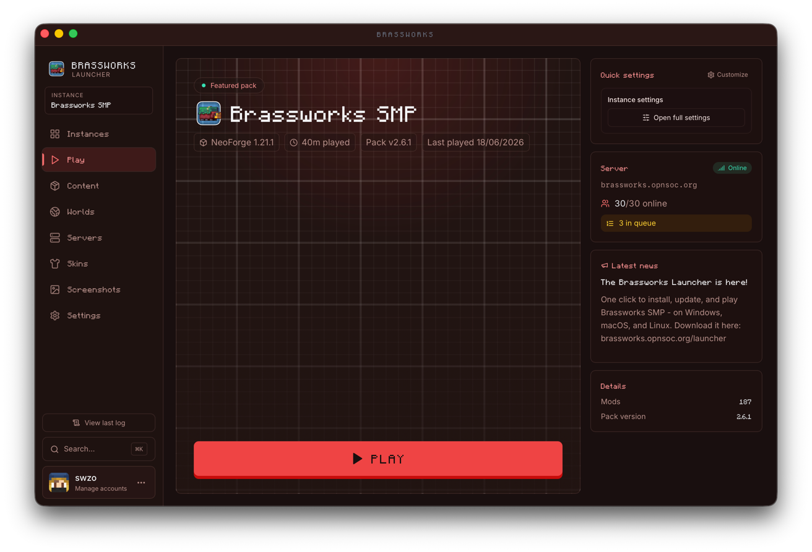
<br><sub><b>Crimson</b></sub>
</td>
<td width="25%" align="center">
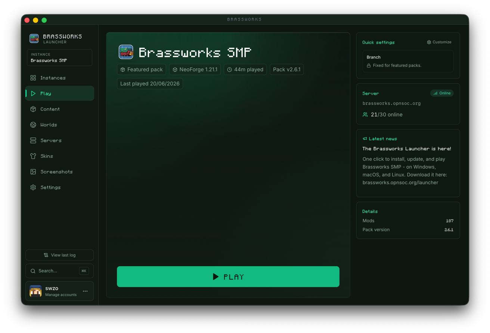
<br><sub><b>Forest</b></sub>
</td>
<td width="25%" align="center">
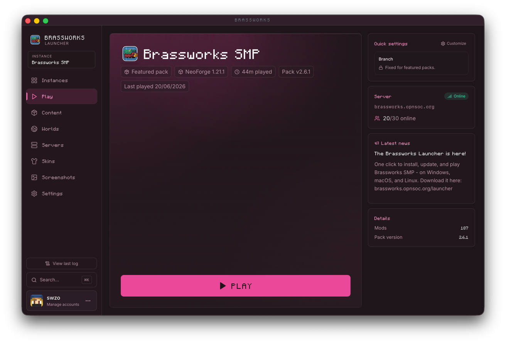
<br><sub><b>Rose</b></sub>
</td>
</tr>
</table>

<table>
<tr>
<td width="50%" align="center">
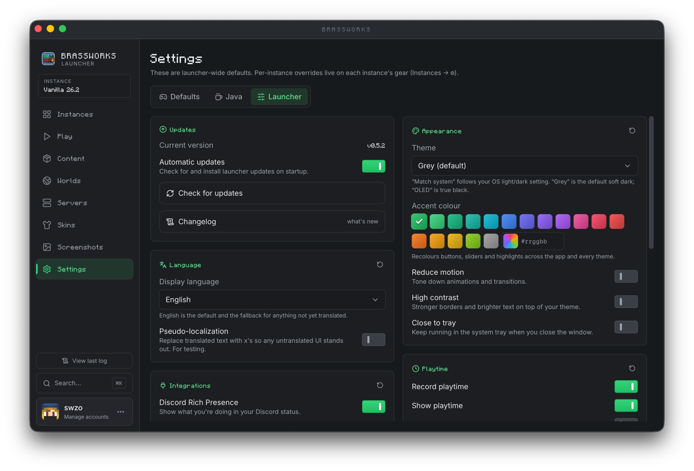
<br><sub><b>Customisable settings and accent colours</b></sub>
</td>
<td width="50%" align="center">
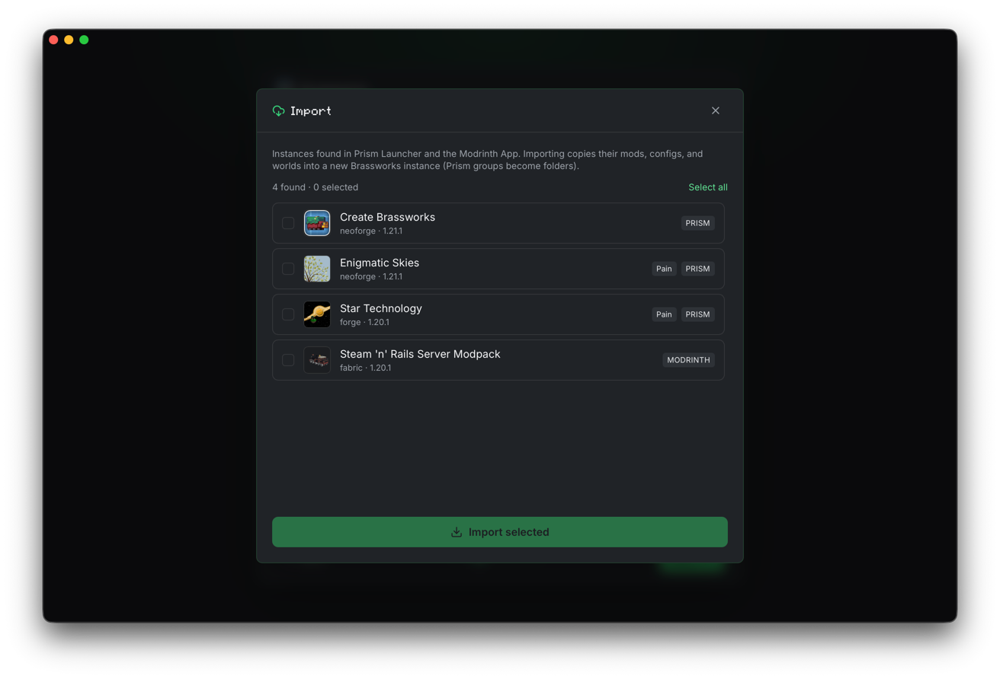
<br><sub><b>Import from Prism Launcher and Modrinth</b></sub>
</td>
</tr>
</table>

---

## Translations

[](https://crowdin.com/project/brassworks-launcher)

Brassworks Launcher is translated on **[Crowdin](https://crowdin.com/project/brassworks-launcher)**. Want the launcher in your language, or spot a wording that's off? Head to the Crowdin project, pick a language (or request a new one), and start translating - no coding required.

How it fits together:

- English is the source language and lives in [`frontend/lib/i18n/locales/en.json`](frontend/lib/i18n/locales/en.json) - the single source of truth, and the file Crowdin uploads as its source. Edit copy there.
- Finished translations come back as `frontend/lib/i18n/locales/<language>.json` and are loaded automatically. Anything not yet translated falls back to English.
- Only languages **more than 40% translated** are offered in the language picker, so users never land on a half-English UI. Per-language completeness is tracked in `frontend/lib/i18n/progress.json`.
- A GitHub Action keeps Crowdin in sync: it uploads new English strings, downloads translations, refreshes `progress.json`, and opens a pull request when anything changes.

---

## Development

The project is a Cargo workspace (Rust crates in `crates/` plus the Tauri shell in `frontend/src-tauri/`) with a React (Vite) frontend in `frontend/`.

### Prerequisites

- **Rust** 1.88 or newer
- **Node.js** 20 or newer
- **pnpm**

On Linux you also need the Tauri/WebKitGTK system libraries - `libwebkit2gtk-4.1-dev`, `libgtk-3-dev`, `libayatana-appindicator3-dev`, `librsvg2-dev`, and `patchelf`.

### To run the app

```bash
cd frontend
pnpm install
pnpm tauri dev
```

`pnpm tauri dev` starts the react and vite dev server and the Tauri window together; it rebuilds on changes to both the Rust and frontend code.

### Build installers

```bash
cd frontend
pnpm tauri build
```

The output is written to `target/release/bundle/`

### Quick checks

```bash
cargo check --workspace
```

---

## License

Brassworks Launcher is licensed under the **GNU General Public License v3.0 or later** (GPL-3.0-or-later). See [LICENSE](LICENSE) for the full text.
